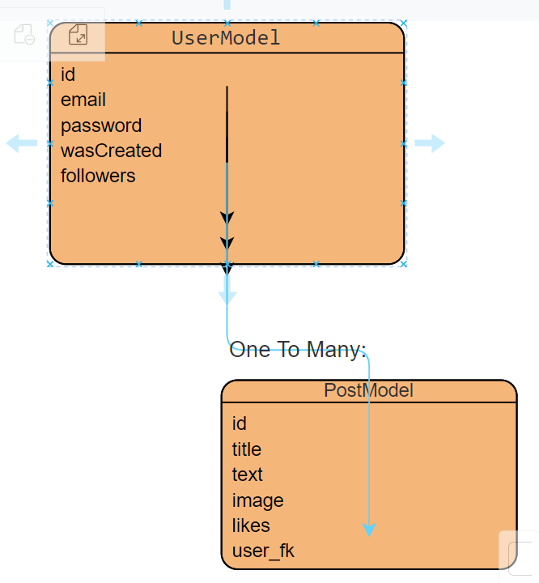

# SOCIAL MEDIA APP 


<!-- 
> A sketch of a social network, using Python - Django Rest Framework, log into the system to access post and user request, or both -->
<!-- ### Ajustes e melhorias

O projeto ainda está em desenvolvimento e as próximas atualizações serão voltadas para as seguintes tarefas: -->
# 🚀 Get started quickly, with docker

- To install, follow these steps:

# After cloning, run:

```
docker-compose build
```

# And then

```
docker-compose up
```
## 📝 Use
Have already created a user, password: 'admin' username: 'admin', use it to obtain a token
it will be necessary for access;
or create a new 'user' in POST- users/
-   NOTE: the database already has some data for api testing, see GET - posts/ and users/

## 🔨 TECHNICAL REQUIREMENTS
- ✅ Field validation
  - handling of API responses
- ✅ Pagination of queries and GET requests
    - navigation with links
- ✅ endpoint authentication and protection
  -   20min session
- ✅ caching with memcached-py
    - cached pages
- ✅ and more

## 👨‍💻 USE CASES
- ✅ Task 1-User Registration
- ✅ Task 2-Post Creation
- ✅ Task 3-Follow/Unfollow User
- ✅ Task 4-Viewing Feed

# ☕ Database scheme
    - for simplicity and small data, sqllite3 was used
        




## 🔨 TESTING
    -RUN python manage.py test


## 📝 Endpoins

## /users
    -GET, and POST users post(open) for new Users
## /posts
    -GET, and POST posts
## /posts/like
    -PATCH, like a post, *id is the mandatory, target argument.
## /login
    -POST, authenticates users to use the API.
## /users/follow
    -GET, follow a user, *id is the mandatory, target argument.
## /users/unfollow
    -GET, unfollow a user, *id is the mandatory, target argument.
## /feed
    -GET, post feed.